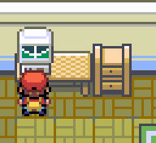
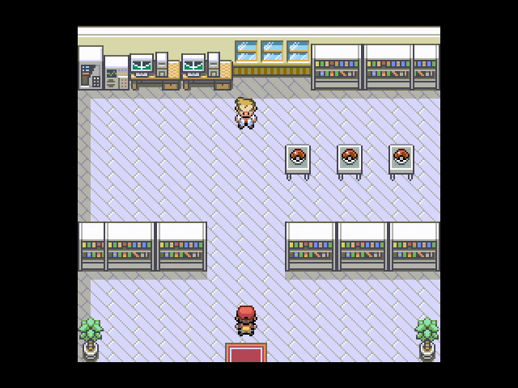
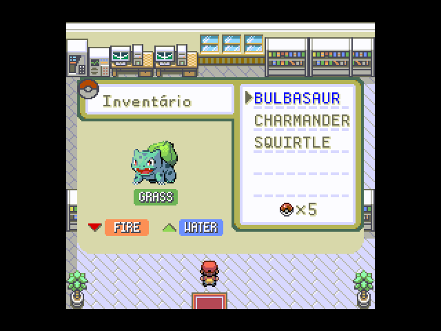
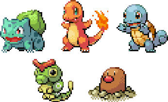
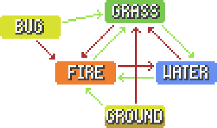

# (OAC - 2022-2): Pokémon FireRed/LeafGreen

<h1 align="center">
    
</h1>

Implementação do jogo Pokémon FireRed/LeafGreen em Assembly RISC-V.

* [Sobre o Projeto](#sobre-o-projeto)
* [Execução](#execução)
    * [Usando o FPGRARS](#usando-o-fpgrars)
    * [Usando o RARS](#usando-o-rars)
    * [Controles e Como Jogar](#controles-e-como-jogar)
* [Funcionalidades](#funcionalidades)
    * [Problemas](#problemas)
* [Créditos](#créditos)

---

## Sobre o projeto

O projeto se trata de uma recriação de parte dos jogos [Pokémon FireRed](https://en.wikipedia.org/wiki/Pok%C3%A9mon_FireRed_and_LeafGreen) e [Pokémon LeafGreen](https://en.wikipedia.org/wiki/Pok%C3%A9mon_FireRed_and_LeafGreen), ambos lançados em 2004 como um remake dos originais [Pokémon Red & Blue](https://en.wikipedia.org/wiki/Pok%C3%A9mon_Red,_Blue,_and_Yellow). O jogo foi desenvolvido como projeto final da discplina de Organização e Arquitetura de Computadores (OAC) ofertada pela [Universidade de Brasília](https://www.unb.br/) durante o semestre 2022/2, feito inteiramente utilizando a ISA RV32IMF do Assembly [RISC-V](https://riscv.org/). O jogo foi idealizado para ser executado com o Kit FGPA DE1-SoC Altera, portanto possui limitações para lidar com a limitada memória de dados (128 KiB) da placa.

<h1 align="center">
    
</h1>

---
## Execução

Para executar o jogo é possível utilizar a ferramenta [RARS](https://github.com/TheThirdOne/rars) ou o [FPGRARS](https://github.com/LeoRiether/FPGRARS), porém usar o FPGRARS é extremamente recomendado.

### Usando o FPGRARS

Baixe o executável da última versão ou utilize o FPGRARS contido no repositório, e execute o arquivo `Pokemon.s` através do comando `./fpgrars Pokemon.s` no terminal ou arrastando o `.s` no executável. Para a execução no FPGRARS abra o arquivo `Pokemon.s` e garanta que o registrador `s9` seja inicializado com valor `FPGRARS`, mais explicações e instruções se encontram no mesmo arquivo.

### Usando o RARS

Embora seja possível em teoria usar o RARS, na prática vai ser praticamente impossível executar o projeto. O jogo não apresenta nenhum erro no RARS, o problema é que ele é lento demais para executa-lo. É possível jogar a parte inicial, mas a partir do momento em que o jogador sai da casa do RED e vai para Pallet o esquema de movimentação se torna mais complexo, de forma que o RARS não consegue executar as instruções rápido o bastante. Como dito na secção acima, abra o arquivo `Pokemon.s` e mude o registrador `s9` para `FPGA_OU_RARS` para que a movimentação seja levemente mais rápida.

Caso você queira usar o RARS e tenha paciência, siga as intruções abaixo:

Use o `Rars15_Custom2.jar` contido no repositório, abra o arquivo `Pokemon.s`, na barra de menu superior clique em "Run" e depois selecione a opção "Assemble" para montar o programa (ou aperte F3).

Em seguida, na barra de menu superior clique em "Tools" e selecione as opções "Bitmap Display" e "Keyboard and Display MMIO Simulator", conecte ambas ao programa clicando em "Connect to Program".

Por fim, na opção "Run" clique em "Go" para executar o jogo (ou aperte F5). O jogo será renderizado na janela da ferramenta "Bitmap Display" e todos os inputs do teclado devem ser digitados na parte inferior da janela do "Keyboard and Display MMIO Simulator".

### Controles e Como Jogar

Nos momentos de história use `ENTER(↵)` para avançar os diálogos.

Use `w`, `a`, `s` e `d` para movimentar o personagem.

Nos menus use também `w`, `a`, `s` e `d` para movimentar entre as opções e `ENTER(↵)` para selecionar uma. 

---
## Funcionalidades    

### História

O projeto tenta ser o mais fiel possível ao original. Sendo assim, replica alguns dos momentos de história encontrados ao decorrer do jogo. 

    

    

### Inventário e Pokémons

O jogo conta com um pequeno inventário para organizar os Pokémons do jogador e as suas Pokébolas. A lista pode naturalmente ser
expandida usando as Pokébolas para capturar até cinco Pokémons durante as cenas de combate.

    

Existem cinco Pokémons no jogo cada um com um tipo diferente:

    

Esquema de tipos dos Pokémons, com seta vermelha indicando que o tipo é fraco contra este, e com a seta verde indicando que é forte:

    

### Combate

O combate do jogo é bem simples. Ao passar por um tile de grama o jogador tem a chance de ser levado para um combate. Na tela de um combate um de cinco Pokémons será escolhido para lutar contra o jogador, por fim o inventário será mostrado para que o jogador escolha um de seus Pokémons para o combate. Na luta existem 3 opções, ATACAR, FUGA, que permite uma chance do jogador terminar a luta, e ITEM, em que o jogador pode escolher do inventário a Pokébola para uma chance de capturar o Pokémon inimigo.

    

### Problemas

Não foi possível encontrar uma boa maneira de gerar números randômicos, portanto o combate apresenta alguns problemas: geralmente apenas alguns dos pokémons serão escolhidos para o combate (quase nunca o Caterpie e o Diglet), e o dano dado tem uma tendência a assumir valores pequenos, de modo que não é incomum aplicar 0 de dano várias vezes seguidas. 

---
## Créditos

* Sprites e imagens usadas no projeto foram retiradas do seguinte site: https://www.spriters-resource.com/game_boy_advance/pokemonfireredleafgreen/
